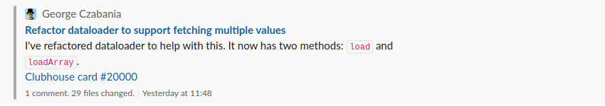

# Git Guru

> A bot that checks Pull Requests and posts them to slack.

## Features

- Can be scheduled to run at a regular interval
- One slack post per Pull Request
- Posts are concise but contain useful information
  - Author
  - Title
  - Link to Pull Request
  - First sentence of description
  - Number of comments
  - Number of files changed
  - Time of last update
  - Link to clubhouse card

## Environment Variables

<dl>
  <dt><code>SLACK_CHANNEL</code></dt>
  <dd>The name of the Slack channel to post to.  e.g. <code>todo</code></dd>
  <dt><code>SLACK_WEBHOOK</code></dt>
  <dd>The incoming webhook URL for your slack channel</dd>
  <dt><code>GITHUB_ORG</code></<dt>
  <dd>The name of your github organization. e.g. <code>mishguruorg</code></dd>
  <dt><code>GITHUB_TOKEN</code></dt>
  <dd>Your Github API token</dd>
  <dt><code>CLUBHOUSE_ACCOUNT</code></dt>
  <dd>Your clubhouse account e.g. <code>mishguru</code></dd>
  <dt><code>SCHEDULE</code></dt>
  <dd>A cron job format, used to run at regular intervals. e.g. <code>0 7 * * 1-5</code></dt>
</dl>
